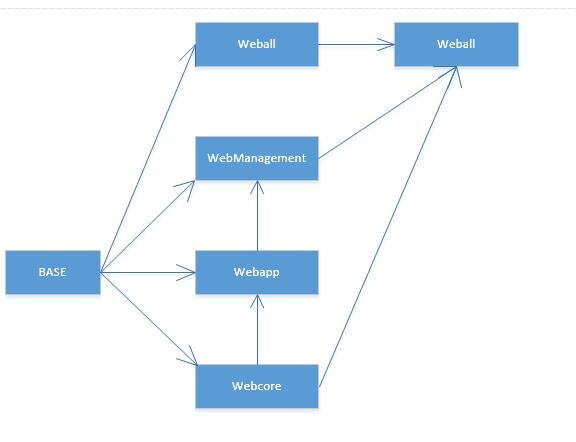

# GradleSide
Gradle 示例大全

1.multi-project : gradle多项目示例

其中项目（Project）或者称之为模块（Module）之间的依赖关系如下图,估计也该够用了，其实勤奋的小伙伴可以好好看下
serguide的第59章，电梯在此 ： [点我点我点我，我是传送门](https://docs.gradle.org/current/userguide/multi_project_builds.html)
